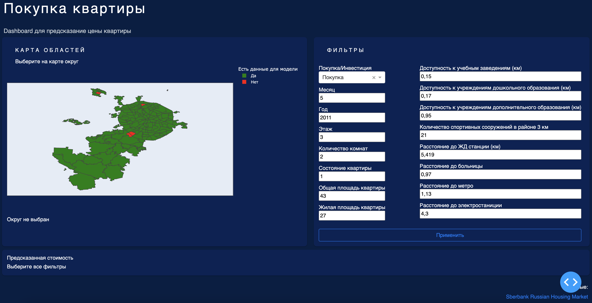

# Dash Predict of apartment price

## About this app

This application uses data from [Kaggle Sberbank's competitions](https://www.kaggle.com/code/danildorofeev/sber-housing). A machine learning model was built that predicts the price of an apartment depending on the selected parameters

## How to run this app

First, clone this repository and open a terminal inside the root folder.

Create and activate a new virtual environment (recommended) by running
the following:

```bash
python3 -m venv myvenv
source myvenv/bin/activate
```

Install the requirements:

```bash
pip install -r requirements.txt
```
Run the app:

```bash
python SBER_FLAT_DASH.py
```
Open a browser at http://127.0.0.1:8050

## Screenshots



## Resources

- To learn more about Dash, check out our [documentation](https://plot.ly/dash).
